# Quiz Master Android App

A feature-rich Android quiz application built with Kotlin and Jetpack Compose. Includes single-player and local multiplayer modes, 6 categories, 3 difficulty levels, a timer system, achievements, and a leaderboard.

## Author

Yasmeen Azmat Ali
MSc Artificial Intelligence
University of West London

---

## Project Overview

A trivia quiz app supporting both solo play and pass-and-play multiplayer (2 players on the same device), with daily challenges, category-based questions, and a full achievement/badge system to track progress.

---

## Features

- 🧠 6 Quiz Categories — Science, History, Sports, Geography, Movies, Music
- 🎚️ 3 Difficulty Levels — Easy, Medium, Hard
- 📅 Daily Challenge — a new challenge every day
- 👥 Multiplayer Mode — 2 players, same phone, pass-and-play with turn indicators
- ⏱ Timer System — countdown timer per question
- ⭐ Star Scoring — live star count as you answer
- 🏆 Leaderboard — tracks best scores per category and difficulty
- 🥇 Achievements — 12 unlockable badges (First Win, Perfect Score, Scientist, Historian, Athlete, Geographer, Cinephile, Musician, Hard Mode, and more)
- 📊 Results Screen — score breakdown with percentage and newly unlocked badges
- 🎮 Player vs Player results — side-by-side score comparison in multiplayer mode

---

## Screenshots

### 🏠 Home Screen
Category selection, difficulty selection, daily challenge banner, and multiplayer toggle.

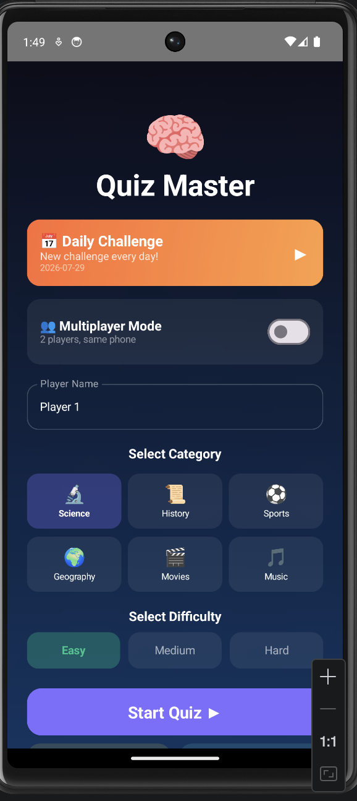

### 🧩 Quiz Gameplay
Timed questions with instant answer feedback (correct/incorrect indicators) and live star tracking.

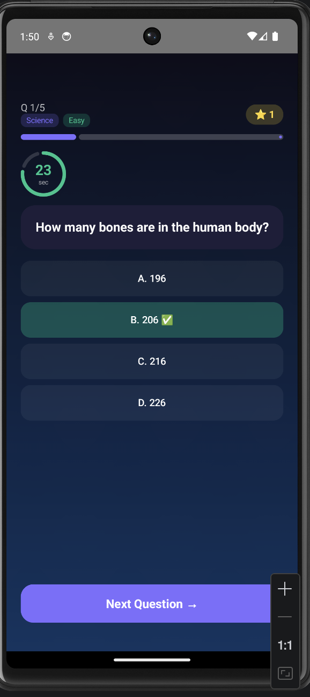

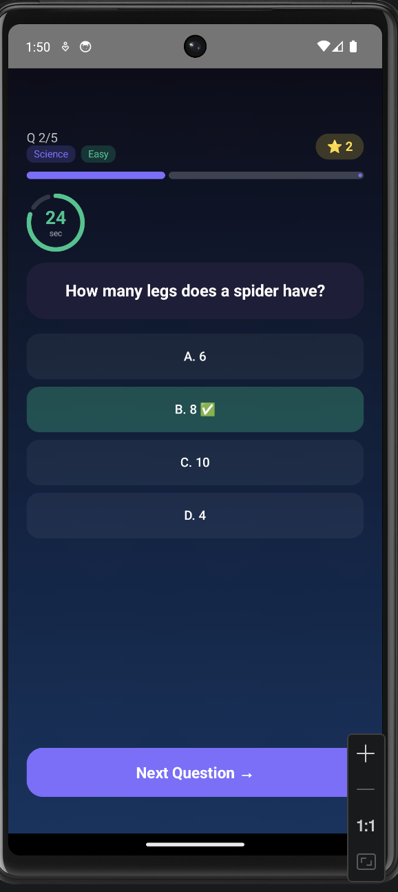

### 👥 Multiplayer Mode
Pass-and-play setup with two player name fields, turn-based question flow, and a "hand the phone" transition screen between turns.

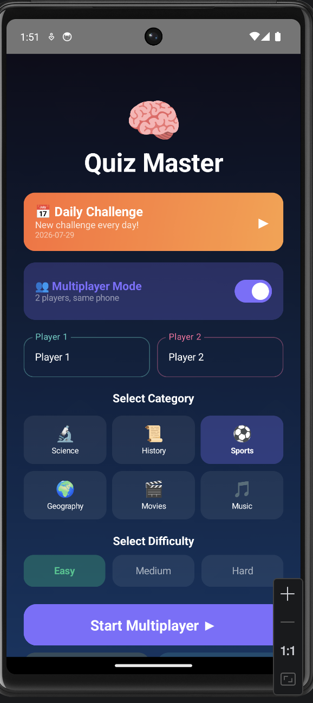

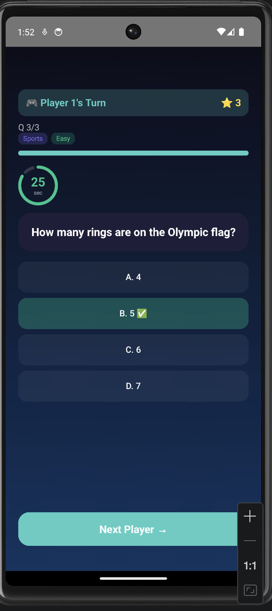

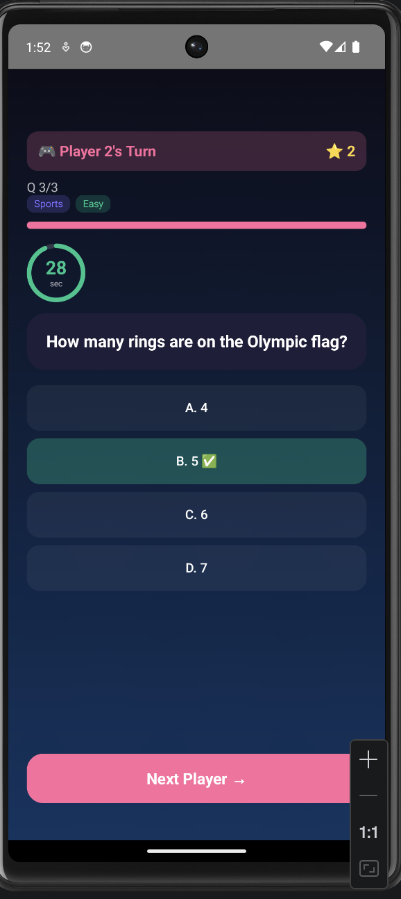

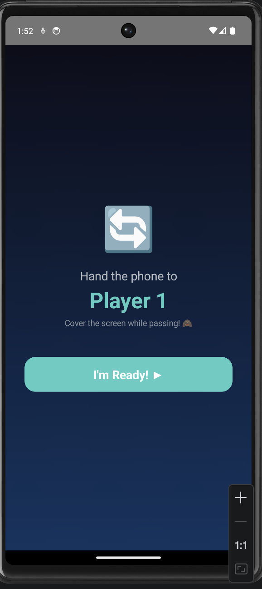

### 🏆 Results & Leaderboard
Score summary after each quiz, multiplayer win screen, and a leaderboard tracking best runs.

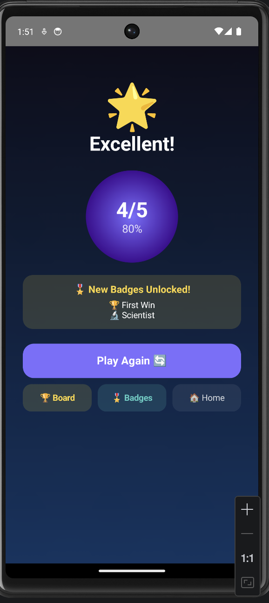

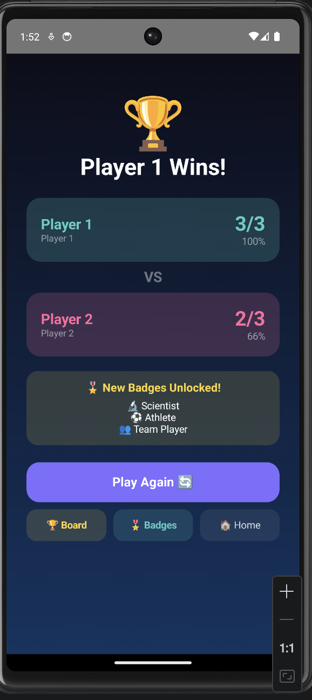

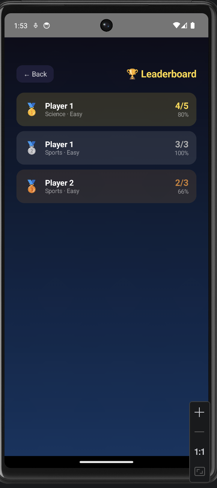

### 🥇 Achievements
12 unlockable badges across categories and milestones.

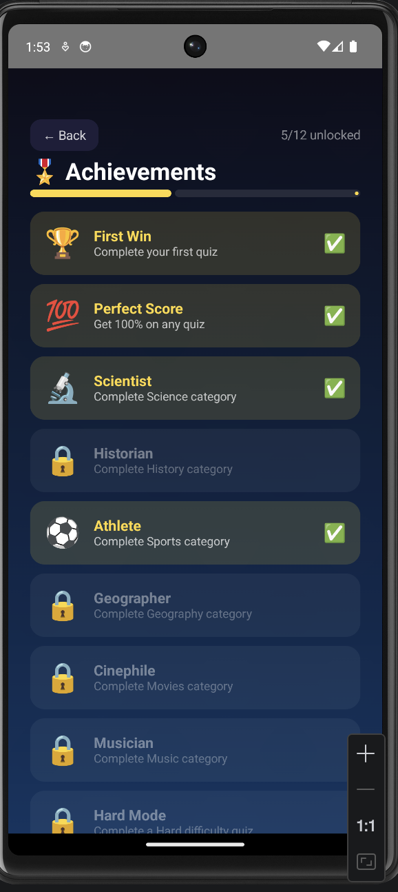

---

## Technologies Used

- Kotlin
- Jetpack Compose
- Material Design 3
- Android Studio
- State Management with remember & mutableStateOf
- Timer logic with Coroutines
- LazyColumn for efficient list rendering

---

## Getting Started

### 1. Clone the repository

git clone https://github.com/yasmeenmh90-beep/QuizMaster.git
cd QuizMaster

### 2. Open in Android Studio

- Open Android Studio
- Click **File → Open**
- Select the QuizMaster folder

### 3. Run the app

- Connect an Android device or start an emulator
- Click the green **▶ Run** button

### 4. Minimum Requirements

- Android API 24 (Android 7.0) or higher
- Android Studio Hedgehog or newer

---

## App Structure

QuizMaster/
├── app/src/main/java/com/example/quizmaster/
│ └── MainActivity.kt # All screens and logic
├── app/src/main/res/
│ ├── drawable/ # App icons
│ └── values/ # Colors, strings, themes
└── build.gradle.kts # Dependencies

---

## Key Screens

| Screen | Description |
|---|---|
| Home | Category, difficulty, daily challenge, multiplayer toggle |
| Quiz | Timed question with 4 answer options |
| Player Handoff | "Pass the phone" transition between multiplayer turns |
| Results | Score summary, percentage, newly unlocked badges |
| Multiplayer Results | Player 1 vs Player 2 comparison |
| Leaderboard | Best scores across category/difficulty |
| Achievements | 12-badge progress tracker |

---

## Future Work

- Online multiplayer (real-time, cross-device)
- More categories and question packs
- Global leaderboard with cloud sync
- Custom quiz creation
- Sound effects and haptic feedback

---

## License

This project is for portfolio purposes.
